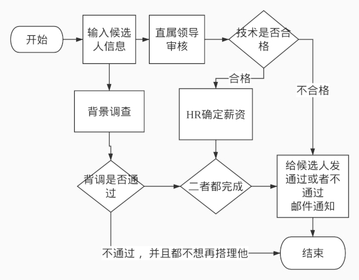

# viewflow-rest

  

provide restful viewflow 

many of code in the project looks like django-viewflow. I want to keep the interface as same as the [django viewflow](https://github.com/viewflow/viewflow).

Thanks you for all the [contributors of viewflow](https://github.com/viewflow/viewflow/graphs/contributors).

**The project is under GPL-3.0 License, any one who change the source code (even if you just use it in intranet of just at home) should upload his code**


# The develop vedio can been seen here
1. [create project](https://www.bilibili.com/video/BV1Zi4y157k4)
2. [create Flow](https://www.bilibili.com/video/BV1Uy4y1B7pR)
3. [Create Start & End Node](https://www.bilibili.com/video/BV1cv411r7Pe/)
4. [Create ViewActivation](https://www.bilibili.com/video/BV185411L7CZ/)
5. [Create If Node](https://www.bilibili.com/video/BV1sp4y1678D/)
6. [Create Split Node](https://www.bilibili.com/video/BV1sp4y1678D/)
7. [Create Join Node](https://www.bilibili.com/video/BV15i4y1L7ao/)
8. [Create Permission](https://www.bilibili.com/video/BV1vD4y197Dr/)


# workflow
A flow contains many nodes  
every node is a instance of Node
every node have a `activation_class`  
every `action_class` instance will `activate_next` by
```
self.flow_task._next  // the next node instance
self.flow_task._next.activate // 
```

## Edge
* src: source Node instance
* dst: target Node instance

## activations
* Attribute
    * `flow_class`
    * `flow_task`: Node Instance defined in the `flows.py`
    * `task`: Current Task

## Nodes
* Function
    * `_incoming`: Edge Instance list
    * `_outgoing`: Edge Instance list

3. models

4. Views

6. Flow


9. rest_extensions

