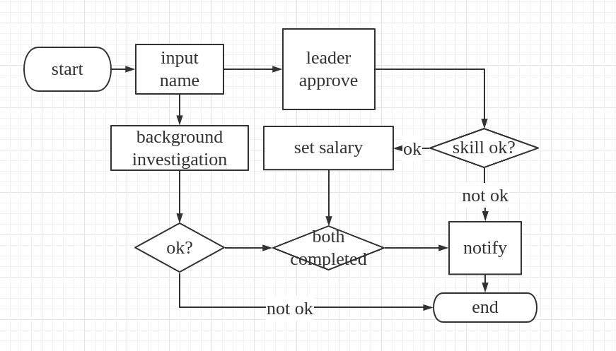

# viewflow-rest


provide restful viewflow 

many of code in the project looks like django-viewflow. I want to keep the interface as same as the [django viewflow](https://github.com/viewflow/viewflow).

Thanks you for all the [contributors of viewflow](https://github.com/viewflow/viewflow/graphs/contributors).

**The project is under `ONLY USE NO PRIVATE CHANGE LICENSE`, any one who change the source code (even if you just use it in intranet of just at home) should publish his code to public**

# Example
the flow graph can been cloned the changed from [this link](https://www.processon.com/view/link/5fa6007f1e0853701cd57cbc).  

## exam flow


this graph like above picture can be written like the below code:  

```
# example_project/exam/flows.py
class ExamFlow(flows.Flow):

    process_class = models.ExamProcess
    task_class = models.ExamTask

    register = nodes.Start(
        viewclass=rest_extensions.AutoCreateAPIView,
        serializer_class=serializers.RegisterExamSerializer,
    ).Next(
        this.select_term
    )

    select_term = nodes.View(
        viewclass=rest_extensions.AutoUpdateAPIView,
        fields=["term"],
    ).Next(this.take_exam)

    take_exam = nodes.View(
        viewclass=rest_extensions.AutoUpdateAPIView,
        fields=["grade"],
    ).Next(this.check_grade)

    check_grade = nodes.If(
        cond=lambda activation: activation.process.passed
    ).Then(this.end).Else(this.select_term)
    end = nodes.End()

```

quite simple and intuitive, right?


## hire flow
[source code](./example_project/hire/flow.py)

```
class HireFlow(flows.Flow):

    process_class = models.HireProcess
    task_class = models.HireTask

    start = nodes.Start(
        viewclass=rest_extensions.AutoCreateAPIView,
        serializer_class=serializers.AddCandidateSerializer,
    ).Permission(
        group=Group.objects.get_or_create(name="hr")[0]
    ).Next(
        this.split_to_3rd_and_direct_leader
    )

    split_to_3rd_and_direct_leader = nodes.Split(
    ).Always(
        this.approve
    ).Always(
        this.background_research
    )

    background_research = nodes.View(
        viewclass=rest_extensions.AutoUpdateAPIView,
        fields=["background_ok"],
    ).Next(
        this.check_background
    )

    check_background = nodes.If(
        cond=lambda activation: activation.process.background_ok
    ).Then(
        this.join_on_both_approve
    ).Else(
        this.end
            )

    join_on_both_approve = nodes.Join().Next(
        this.notify
    )

    notify = nodes.View(
        viewclass=rest_extensions.AutoUpdateAPIView,
        fields=["notified"],
    ).Next(
        this.end
    )

    approve = nodes.View(
        viewclass=rest_extensions.AutoUpdateAPIView,
        serializer_class = serializers.ApproveSerializer,
        # fields=["approved"],
    ).Permission(
        group=Group.objects.get_or_create(name="leader")[0]
    ).Next(
        this.check_if_approve
    )

    check_if_approve = nodes.If(
        cond=lambda activation: activation.process.approved
    ).Then(
        this.set_salary
    ).Else(
        this.notify
    )

    set_salary = nodes.View(
        viewclass=rest_extensions.AutoUpdateAPIView,
        fields=["salary"],
    ).Permission(
        group=Group.objects.get_or_create(name="hr")[0]
    ).Next(
        this.join_on_both_approve
    )

    end = nodes.End()
```

* 中文版  

* English  


# Quick Start
use the `example_project` as a example


```
git clone git@github.com:ramwin/viewflow-rest.git
cd vieflow-rest/example_project/
sudo pip3 install -r ./requirements.txt
python3 manage.py migrate
python3 manage.py runserver
# visit http://localhost:8000/exam/ or http://localhost:8000/hire/ to get the api
```

# Change Log
## 3.0.0 warning: break change abount the signals
The `post_finish` and `post_start` signal not use the `flow_task` instead of a `flow_process` as a sender. You should change your code from 

    task_started.connect(function, ProcessClass)

to 

    task_started.connect(function, ProcessClass.one_of_its_flow_task)


# FAQ
* How To Update the Task manually
```
task = models.FlowTaskModel.objects.get(id=4)
task.auto_finish(operator=User) or operator=None
```


# The develop vedio can been seen here
1. [create project](https://www.bilibili.com/video/BV1Zi4y157k4)
2. [create Flow](https://www.bilibili.com/video/BV1Uy4y1B7pR)
3. [Create Start & End Node](https://www.bilibili.com/video/BV1cv411r7Pe/)
4. [Create ViewActivation](https://www.bilibili.com/video/BV185411L7CZ/)
5. [Create If Node](https://www.bilibili.com/video/BV1sp4y1678D/)
6. [Create Split Node](https://www.bilibili.com/video/BV1sp4y1678D/)
7. [Create Join Node](https://www.bilibili.com/video/BV15i4y1L7ao/)
8. [Create Permission](https://www.bilibili.com/video/BV1vD4y197Dr/)
9. [0.3.0](https://www.bilibili.com/video/BV1Av411r73n/)
    * one task for every `flow_task`
    * add `serializer_class` parameters for `rest_extentions.views`
    * add `operator` for every task


# term

## workflow
A flow contains many flow\_tasks/nodes  
```
# here exam_flow is a workflow
# it contains three flow_tasks, which were register, do, end
class ExamFlow(flows.Flow):
    register = nodes.Start(
        ...
    ).Next(this.do)
    do.nodes.View(
        ...
    ).Next(this.end)
    end = nodes.End()
exam_flow = ExamFlow()
```
every flow\_task is a instance of Node
every flow\_task have a `activation_class`  
every `action_class` instance will `activate_next` by
```
self.flow_task._next  // the next node instance
self.flow_task._next.activate // 
```

## flow\_task

## Edge
* src: source Node instance
* dst: target Node instance

## activations
* Attribute
    * `flow_class`
    * `flow_task`: Node Instance defined in the `flows.py`
    * `task`: Current Task

## Nodes
* Function
    * `_incoming`: Edge Instance list
    * `_outgoing`: Edge Instance list

3. models

4. Views

6. Flow


9. rest_extensions
